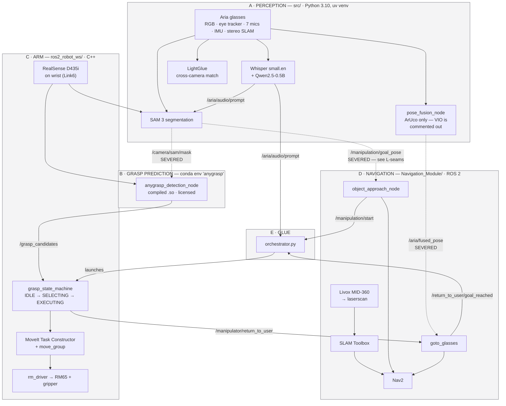
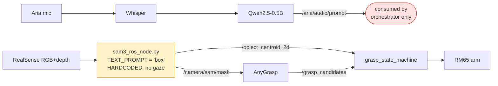
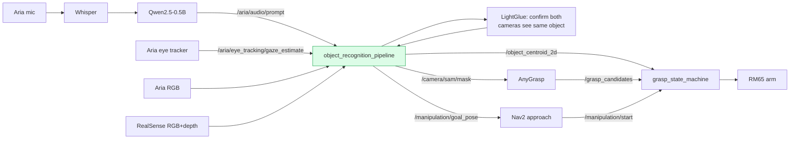
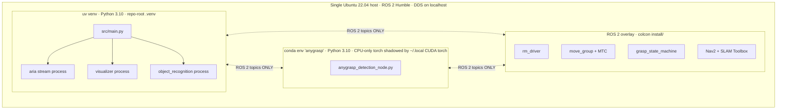
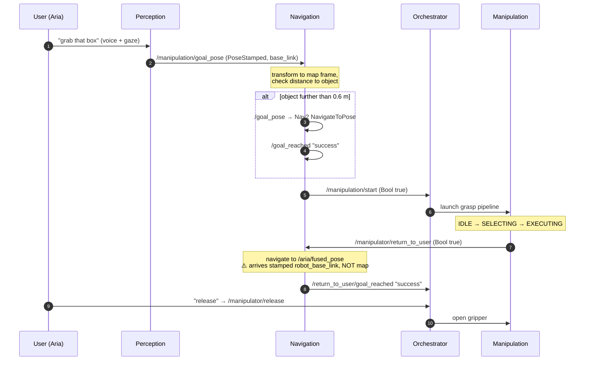
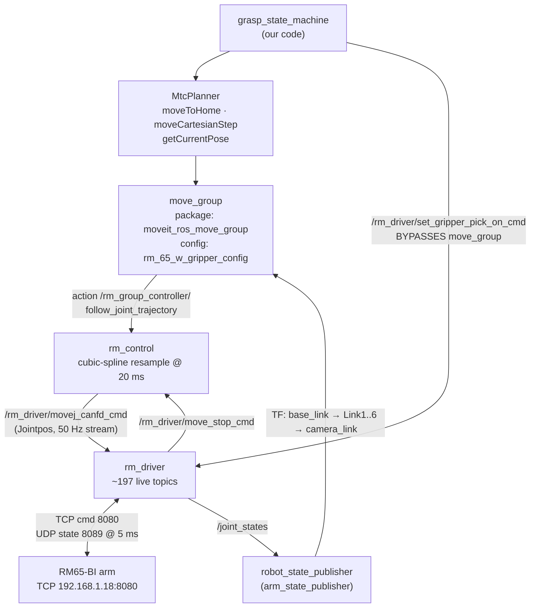
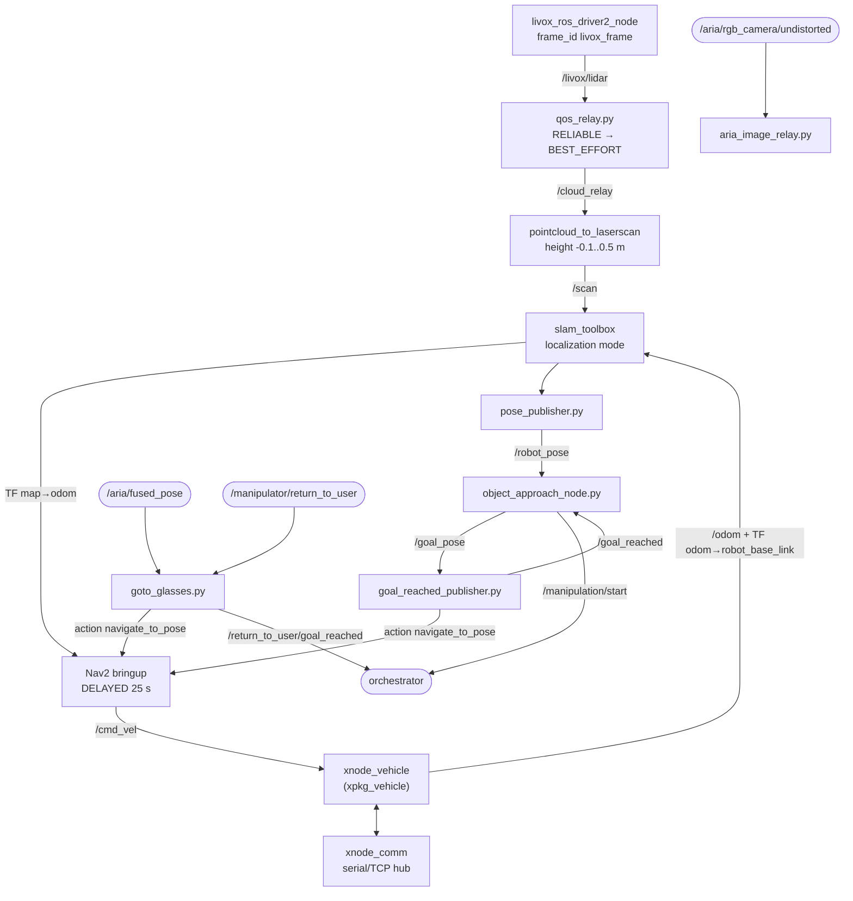
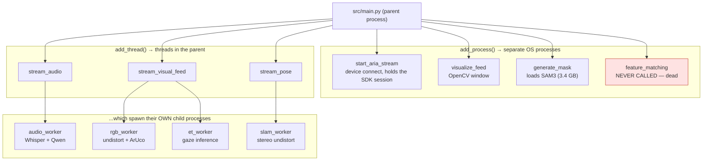
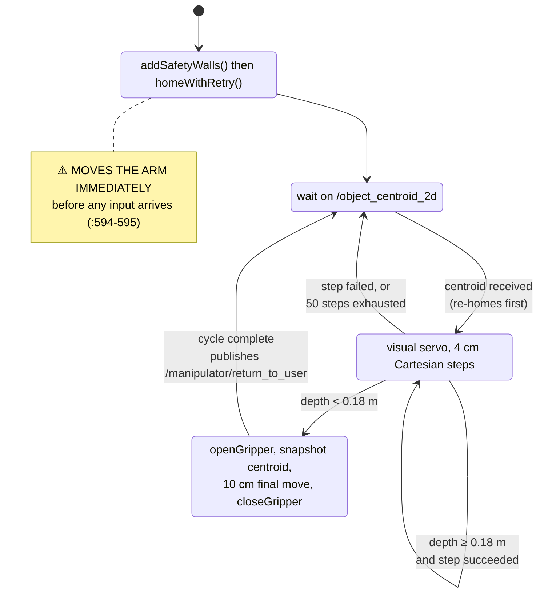

# ARCHITECTURE DIAGRAMS

Companion to [`ORIENTATION.md`](ORIENTATION.md) (prose), [`NEXT_STEPS.md`](NEXT_STEPS.md) (the
work register) and [`READING_GUIDE.md`](READING_GUIDE.md) (a guided walk through the code). Read
ORIENTATION first; this file is the visual reference. Index: [`START_HERE.md`](START_HERE.md).

**These diagrams are Mermaid.** They render automatically on GitHub — just open this file in the
browser. They are plain text on purpose: they diff in pull requests, and an AI assistant pointed
at this repo can both read and update them. When you change the wiring, change the diagram in the
same commit.

**Levels:** L0 system → L1 per subsystem → L2 per module. L3 (the exhaustive topic table) lives in
`ORIENTATION.md` §5.

Status tags as in ORIENTATION: `[code]` verified by reading source, `[reported]` from the
2026-08-25 hardware session, `[inferred]` my reading of intent.

---

## L0 — The system

Five subsystems. The **only** coupling between them is ROS 2 topic name + message type; nothing
imports across a boundary. Dashed red edges are **currently severed** (§ ORIENTATION 6).



**Why B is its own box.** AnyGrasp ships a compiled `.so` built against an old
PyTorch/MinkowskiEngine stack that cannot coexist with SAM 3's dependencies. It runs under
`conda run -n anygrasp` and communicates **only** over ROS topics. Any change that makes it import
project code will break it — note that the perception bundles on
`/aria/rgb_camera/object_masks` etc. carry Python **pickle**, so B can never subscribe to those.

---

## L-seams — Current reality vs. intended design ★

The single most important diagram here. **Green = works today. Red dashed = disconnected.**

### What actually runs today `[code]`



Two independent islands. The voice command reaches the orchestrator but **never influences what
gets segmented**. The arm grasps whatever matches the literal word `"box"`.

### What the design intends



### The cuts `[code]`

| # | Where | What is disabled | Effect |
|---|---|---|---|
| 1 | `src/main.py:107-112` | 4 of 6 pipeline stages commented out — visualization, object recognition, image streaming, pose streaming | Glasses emit **only** `/aria/audio/prompt`. No RGB, gaze, ArUco, IMU. `/aria/fused_pose` never fires ⇒ "come back to me" is dead. |
| 2 | `object_recognition_pipeline.py:389` | `_publish_mask_and_centroid(...)` call commented out | The gaze-selected mask never reaches the robot. `sam3_ros_node.py` does the job instead with a hardcoded prompt. |
| 3 | `orchestrator.py:57-62` | Return-leg subscriptions commented out | Navigate-back-to-user is not wired. |
| 4 | `pose_fusion_node.py:135-140, 243-289` | VIO subscription + handler commented out | Publishes an ArUco-only pose stamped `robot_base_link`, not the fused `map`-frame pose its README claims. ORIENTATION §6.4 |
| 5 | `object_recognition_pipeline.py:34-36` vs `sam3_ros_node.py:30-32` | *Nothing* is disabled — both nodes claim the same three topics | Restoring cut 2 creates two publishers racing on `/object_centroid_2d`. Fix ownership first: NEXT_STEPS §2.2 |

⚠️ **These are cut points, not bugs.** They look deliberate — a way to test the arm without
depending on the perception stack. Uncommenting them without understanding why will produce a
confusing mess. Restore **one at a time** so failures are attributable.

---

## L0b — Process and environment boundaries

Which code runs in which interpreter matters more here than in most projects.



`[reported]` **Trap:** `ros2_robot_ws/src/main.py` launches AnyGrasp via `conda run`, which
inherits `PYTHONPATH` and `AMENT_PREFIX_PATH` from the parent shell. Launch from an unsourced
terminal and that node dies on import while everything else looks fine. Also: never set
`PYTHONNOUSERSITE=1` — conda's torch is CPU-only, and the pipeline depends on `~/.local`'s CUDA
build winning `sys.path`.

---

## L0c — The nav ↔ manipulation contract

The boundary a replacement navigation stack (HiCo-Nav) must satisfy. Everything else is internal
to one subsystem.



**For a navigation replacement, the key question is:** does it emit **`/goal_pose`** (goals, for a
Nav2 controller to execute — slots in beside `goal_reached_publisher.py`, Nav2 stays) or
**`/cmd_vel`** (velocities — displaces the controller plugin in `nav2_params.yaml`, much bigger
change)? See ORIENTATION §10.

---

## L1a — Subsystem C: the arm, end to end

How a MoveIt plan becomes joint motion. `[code]`



**`rm_control` is not a `ros2_control` hardware interface** — it is a shim that impersonates the
controller MoveIt expects. It hosts the `FollowJointTrajectory` action server MoveIt's
`moveit_simple_controller_manager` targets, fits each joint's trajectory with a cubic spline,
resamples at 20 ms, and streams the samples as individual `Jointpos` messages on
`/rm_driver/movej_canfd_cmd` (`rm_control.cpp:279-290`, timer at `655-726`).

**The gripper deliberately bypasses MoveIt.** `moveit_controllers.yaml:7` has `gripper_controller`
commented out, so MoveIt never dispatches gripper trajectories. That is why
`grasp_state_machine.cpp` publishes `Gripperset` / `Gripperpick` straight to `rm_driver` — it is
the only path available, not a shortcut.

### `background.launch.py` — exactly four processes `[code]`

| Process | Package / executable | Role |
|---|---|---|
| `rm_driver` | `rm_driver` / `rm_driver` | TCP+UDP bridge to the arm |
| `arm_state_publisher` | `robot_state_publisher` | `/robot_description` + arm TF |
| `rm_control` | `rm_control` / `rm_control` | trajectory → servo stream |
| `move_group` | `moveit_ros_move_group` | MoveIt planning |

No RViz, no `controller_manager`, no Gazebo. **It connects to the real arm** — not safe to launch
unattended.

### rm_driver's topic surface

~108 publishers / ~89 subscriptions. Nearly all follow one pattern:
**`rm_driver/<verb>_cmd`** (you publish) → **`rm_driver/<verb>_result`** (`Bool` ack). You will
only ever touch a handful:

| Group | Count | The ones that matter |
|---|---|---|
| State feedback | ~23 | `joint_states`, `rm_driver/udp_arm_position`, `udp_arm_current_status` |
| Motion | ~12 pairs | `movej_cmd`, `movel_cmd`, **`movej_canfd_cmd`** (the servo stream `rm_control` uses) |
| Gripper | 11 pairs | `set_gripper_position_cmd`, `set_gripper_pick_on_cmd` |
| Safety | 9 pairs | **`emergency_stop_cmd`**, `move_stop_cmd`, `pause_cmd` |
| IO / Modbus / frames / trajectory files | ~110 | ignore unless you need them |

### Arm TF chain `[code]`

```
base_link → Link1 → Link2 → Link3 → Link4 → Link5 → Link6
                                                      ├→ camera_link → ... → camera_color_optical_frame
                                                      ├→ gripper_base_link → gripper_Link1..4
                                                      └→ grasp_frame   (virtual TCP)
```

The D435i is attached at `rm_65_w_gripper.urdf.xacro:23-25` — `parent="Link6"`, offset
`xyz="-0.0125 0.0475 0.014" rpy="0 -1.5708 -1.5708"`. The `camera_link → camera_color_optical_frame`
sub-chain comes from the external `realsense2_description` package, **not vendored here** — so
that part of the tree only exists when the RealSense driver is running. Planning group is
`rm_group` (`base_link → Link6`), joints `joint1..joint6`.

---

## L1b — Subsystem D: navigation

`[code]` Node graph from `slam_localization.launch.py` (the fuller of the two launch files).



### Mapping vs localization launch — they are not interchangeable `[code]`

| | `slam_mapping` | `slam_localization` |
|---|---|---|
| SLAM node | `async_slam_toolbox_node` | `localization_slam_toolbox_node`, loads `~/maps/completed_map` |
| Map autosave | ✅ every 30 s | ❌ |
| `robot_base_link → base_link` static TF | ❌ **absent** | ✅ `0.18 0 0.48 3.14159 0 0` |
| `goto_glasses`, `object_approach_node`, `aria_image_relay` | ❌ | ✅ |

⚠️ **The arm is not in the TF tree during a mapping run.** Anything transforming `base_link → map`
fails silently there. Note the arm is mounted **yawed 180° — it faces backward** relative to the
base.

### TF tree `[code]`

```
map                         (slam_toolbox)
 └─ odom                    (slam_toolbox)
     └─ robot_base_link     ← MOBILE BASE root (xnode_vehicle odometry)
         ├─ livox_frame     static: 0.18 0 0.2
         ├─ base_link       ← ARM root. static: 0.18 0 0.48, yaw π. LOCALIZATION LAUNCH ONLY
         └─ wheels, casters, shells (URDF)
```

Nav2 uses `robot_base_frame: robot_base_link` throughout. Footprint is **circular,
`robot_radius: 0.2 m`** — no polygon configured.

⚠️ **Missing dependency.** Both launch files include `bringup_basic_ctrl.launch.py` from a package
`xpkg_demo` that **does not exist in this repo** (declared `exec_depend` in
`robot_slam/package.xml:12`). `colcon build` may pass; launching will not. See ORIENTATION §8.6.

---

## L2 — Process and thread model inside `src/`

`[code]` This is subtler than it looks, and getting it wrong will cost you hours of debugging.
`multiprocessing.set_start_method("spawn")` (`main.py:435`), so **every child re-imports
everything and re-initialises CUDA independently.**



### The handoff pattern — latest-wins, never FIFO `[code]`

Every sensor path uses the same shape:

```
Aria SDK callback thread
   → Observer (routes by camera/IMU id)
      → _put_latest() into multiprocessing.Queue(maxsize=1)
         │  drops any stale item first, non-blocking — NEVER blocks the SDK thread
         └→ worker process: queue.get(timeout=0.1) loop
              → ROSPublisher.publish()
```

`_put_latest` is defined identically in `image_streaming_pipeline.py:30-39` and
`pose_streaming_pipeline.py:41-50`. With `maxsize=1` this is a **single-slot mailbox that drops
old frames**, not a buffer. Frames are dropped by design — do not "fix" this.

Two deviations from the pattern:
- **IMU is published synchronously on the SDK callback thread** (`pose_streaming_pipeline.py:260-285`)
  — no queue, no offload. Contradicts the module's own stated design.
- **Audio uses a ring buffer, not a queue** (`audio_streaming_client_observer.py:27`): a
  lock-guarded 7-channel numpy array, polled once per second by the pipeline's own loop.

`ObjectRecognitionPipeline` uses the same idea in-process: `CameraFeed` / `RealSenseFrame` are
lock-guarded latest-value holders returning a defensive `.copy()` plus a monotonic frame ID;
callers compare IDs to detect new data. It spawns exactly **one** thread (the ROS executor spin);
SAM3 inference runs inline on the main loop.

### Shutdown `[code]`

`ProcessManager` holds two `multiprocessing.Event`s shared by every child:

- **`aria_streaming_started`** — one-shot startup gate. Stages `.wait()` on it before real work.
- **`quit_event`** — the sole shutdown signal. Every worker loops `while not quit_event.is_set()`.

⚠️ `add_thread` does **not track** what it creates (`process_manager.py:25`) — there is no
`self.threads`. `cleanup()` joins and terminates processes only; threads die only because they are
daemons. A hung thread will not be cleaned up.

---

## L2b — The grasp state machine

`[code]` `grasp_state_machine.cpp`. Guard conditions on the edges.



Tuning constants (lines 32-46): `APPROACH_STEP_M 0.04` · `APPROACH_STEP_FINAL 0.10` ·
`MAX_APPROACH_STEPS 50` · `EXECUTE_DEPTH_THRESH_M 0.18` · `CENTROID_TARGET_OFFSET_X 55.0` px ·
stability = 5 frames within 15 mm / 10°.

`USE_SIMPLE_EXECUTE = true` (line 40) — so the AnyGrasp candidate-evaluation path is compiled but
**not taken**. The arm currently does a blind 10 cm push toward the centroid and closes the
gripper; `/grasp_candidates` is subscribed but unused in this mode. Worth knowing before you debug
AnyGrasp output.

See ORIENTATION §8.2 for the three self-annotated bugs in the EXECUTING branch.

---

## Maintaining these diagrams

- Change the diagram in the same commit as the wiring change.
- Keep the `[code]` / `[reported]` / `[inferred]` tags honest.
- Cite `file.py:123` in the tables under each diagram, not inside diagram nodes (line numbers
  drift and make diagrams noisy).
- If a diagram grows past ~25 nodes, split it into another level rather than letting it sprawl.

| Date | Who | Change |
|---|---|---|
| 2026-09-09 | Claude (Opus 5) | Initial: L0, L-seams, L0b process boundaries, L0c contract sequence. L1/L2 pending agent results. |
| 2026-09-10 | Claude (Opus 5) + Dion | Cuts table now lists all five (added pose-fusion VIO and the duplicate-publisher collision). Linked NEXT_STEPS.md. |
| 2026-09-09 | Claude (Opus 5) | Added L1a (arm end-to-end + rm_driver surface + TF chain), L1b (nav node graph, mapping-vs-localization, TF tree), L2 (process/thread model, latest-wins handoff), L2b (state machine transitions). Corrected `/aria/fused_pose` frame in L0c. |
| 2026-09-13 | Claude (Opus 5) + Dion | Cuts table: seam #2 citation `object_recognition_pipeline.py:384`→`:389`, shifted by uncommitted comments in that file. |
