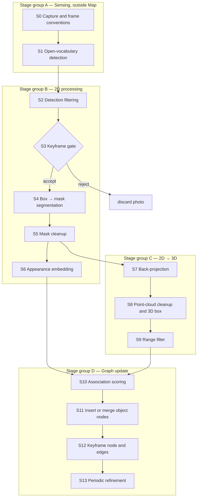

# Cognitive Memory Graph — Construction Pipeline (Pixels → Nodes)

How HiCo-Nav turns a raw RGB-D photo into graph nodes and edges, written as
a **set of separate stages you can build one at a time**. Each stage lists
its input, output, algorithm, parameters, pitfalls and an acceptance test,
so each one can be built and tested on its own before the next is started.

Companion docs:
- [`map_class_diagram.md`](map_class_diagram.md) covers the data model and
  the input contracts.
- [`cmg_usage_flow.md`](cmg_usage_flow.md) covers how the finished graph is
  driven and queried at runtime.

Line references are against commit `ffc1517`. Parameter values are from
`cfg/hm3d.yaml`.

---

## 1. The core idea

A graph needs discrete nodes and edges, and a camera produces a grid of
pixels. HiCo-Nav never makes pixels into nodes. Instead:

| Graph element | Built from | Pixels survive as |
|---|---|---|
| **Object node** (`Object3D`) | One **object detection**, with its pixels lifted into 3D through depth + pose, cleaned into a point cloud, then merged with earlier sightings of the same object | A coloured 3D point cloud, a CLIP vector, and a label vote history |
| **Keyframe node** (`Keyframe`) | One **accepted photo**, downsized | The stored RGB + depth + intrinsics, which can be re-projected later |
| **Edge** | "Photo *k* saw object *o*" | Two id sets: `Keyframe.objects_3d` ↔ `Object3D.observers` |

So the step that bridges pixels and the graph is **detection, then
segmentation, then back-projection**. Everything else either cleans up the
noise that step introduces or decides whether a 3D blob is a new object or
one already in the graph.

---

## 2. Pipeline at a glance



| # | Stage | Input → Output | Source | Needs |
|---|---|---|---|---|
| S0 | Capture and frame conventions | sensor → `Observation` | `habitat/nav_runner.py:130`, `habitat/habitat_data.py:288` | — |
| S1 | Open-vocabulary detection | RGB → `Detections` | `nav_runner.py:91,161` | S0 |
| S2 | Detection filtering | `Detections` → `Detections` | `map/map_utils.py:183` | S1 |
| S3 | Keyframe gate | pose + labels → bool | `map/map.py:513` | S2 |
| S4 | Box → mask segmentation | RGB + boxes → masks | `map/map.py:630` | S2 |
| S5 | Mask cleanup | masks → masks | `map/map_utils.py:257,295` | S4 |
| S6 | Appearance embedding | RGB + boxes → CLIP vectors | `map/map_utils.py:95` | S5 |
| S7 | Back-projection | depth + masks + K + pose → point clouds | `map/pointcloud.py:138` | S5 |
| S8 | Point-cloud cleanup and 3D box | point cloud → point cloud + OBB | `map/pointcloud.py:366,124` | S7 |
| S9 | Range filter | candidates → candidates | `map/map.py:439` | S8 |
| S10 | Association scoring | candidates × graph → match list | `map/map.py:814`, `map/pointcloud.py:615`, `map/map_utils.py:357,377` | S6, S9 |
| S11 | Insert or merge object nodes | match list → updated `objects_3d` | `map/map.py:475`, `map/map_elements.py:139` | S10 |
| S12 | Keyframe node and edges | photo + object ids → `Keyframe` | `map/map.py:866` | S11 |
| S13 | Periodic refinement | graph → graph | `map/map.py:965`, `map/pointcloud.py:787` | S12 |

S0–S1 run in the data process. S2–S13 run inside one call to
`Map.update_scene_graph` ([`map.py:551`](../map/map.py)), once per view.

---

## 3. Interfaces between stages

Define these types first. After that, every stage is a pure function from
one of them to another, which is what lets the stages be built and tested
separately.

```python
@dataclass
class Observation:            # S0 output
    rgb: np.ndarray           # uint8 (H, W, 3), RGB order
    depth: np.ndarray         # float32 (H, W), metres, 0 = invalid
    K: np.ndarray             # (3, 3) pinhole intrinsics
    T_world_cam: np.ndarray   # (4, 4) camera→world, OpenCV camera axes, z-up world
    frame_id: int             # globally unique, monotonic, never reset

@dataclass
class Detections:             # S1/S2 output
    xyxy: np.ndarray          # float (N, 4), pixel coords
    conf: np.ndarray          # float (N,), SORTED DESCENDING
    class_id: np.ndarray      # int (N,), indexes the vocabulary list
    label: list[str]          # len N
    masks: np.ndarray | None  # bool (N, H, W), filled by S4 if None

@dataclass
class Candidate:              # S7–S9 output, one per surviving detection
    points: np.ndarray        # (M, 3) world frame
    colors: np.ndarray        # (M, 3) in [0, 1]
    obb: OrientedBox          # centre, axes, half-extents
    clip: np.ndarray          # (D,) L2-normalised, from S6
    label: str
    conf: float

@dataclass
class ObjectNode:             # graph node (Object3D)
    id: int
    points, colors, obb
    clip: np.ndarray          # sighting-weighted mean
    labels: list[str]         # one entry per sighting; majority vote = label
    confs: list[float]
    observers: set[int]       # keyframe ids — the edges

@dataclass
class KeyframeNode:           # graph node (Keyframe)
    id: int
    rgb, depth, K             # resized to 448×448, with K rescaled to match
    T_world_cam: np.ndarray
    detections: Detections    # raw S1 detections, pre-filter
    objects: set[int]         # object ids — the edges
    task_score: float
```

---

## 4. Stages

Each stage has the same subsections:
- **Goal**: what the stage does.
- **Input and output**: which interface types from §3 it consumes and produces.
- **Algorithm**: how the reference code does it.
- **Params**: config keys and their values in `cfg/hm3d.yaml`.
- **Pitfalls**: known traps and bugs.
- **Done when**: an acceptance test.

### Stage group A — Sensing (outside the graph)

#### S0 · Capture and frame conventions

- **Goal:** produce a posed, metric RGB-D observation in one consistent
  world frame.
- **Input and output:** sensor → `Observation`.
- **Algorithm (reference):**
  - At each robot position, rotate in place and capture several views: 7 at
    40° spacing on the first step, 3 at 60° spacing afterwards
    ([`nav_runner.py:143`](../habitat/nav_runner.py)).
  - Convert RGBA → RGB with `rgba2rgb`.
  - Use depth as-is, in metres, with no hole filling
    (`use_depth_estimation: False`).
  - Build the pose from the depth sensor's state, then convert Habitat's
    y-up frame to z-up with `pose_habitat_to_tsdf`
    ([`nav_runner.py:165`](../habitat/nav_runner.py)).
- **Params:** `img_width`/`img_height` 640, `hfov` 120, `camera_height` 1.5,
  `extra_view_phase_{1,2}`, `extra_view_angle_deg_phase_{1,2}`.
- **Pitfalls:**
  - BGR from OpenCV cameras.
  - Depth in millimetres from real sensors.
  - A world-to-camera pose passed where camera-to-world is expected.
  - Applying a frame conversion twice.
  - Depth and RGB at different resolutions, or not aligned.
- **Done when:** back-projecting the full depth map from two poses gives
  point clouds that overlap in the world frame (the same wall lands in the
  same place).

#### S1 · Open-vocabulary detection

- **Goal:** turn pixels into labelled boxes. This is the first and most
  important abstraction step.
- **Input and output:** `Observation.rgb` → `Detections`.
- **Algorithm (reference):**
  - Run YOLO-World `yolov8x-world.pt` on the full-resolution image with
    `conf=0.1` ([`nav_runner.py:161`](../habitat/nav_runner.py)).
  - The vocabulary is set with `set_classes(...)` to ScanNet-200 plus any
    classes the VLM has added.
  - Unpack the results with `_extract_detections`
    ([`nav_runner.py:91`](../habitat/nav_runner.py)).
  - If the model is a segmentation model, its masks are resized to the image
    with nearest-neighbour interpolation and eroded as in S4.
- **Params:** `yolo_model_name`, `class_set: scannet200`.
- **Pitfalls:**
  - **Output must be sorted by confidence, highest first.** S2 depends on it.
    Ultralytics does this already; other detectors may not.
  - `class_id` must index the *same* vocabulary list the graph uses. Re-set
    the detector's classes whenever the vocabulary grows.
- **Done when:** on a test image, boxes, labels and confidences line up and
  `class_id` → vocabulary gives back `label`.

### Stage group B — 2D processing

#### S2 · Detection filtering

- **Goal:** drop detections that should never become objects.
- **Input and output:** `Detections` → `Detections`.
- **Algorithm:** process detections in confidence order and drop any that is:
  1. a background class (`bg_classes`), when `skip_bg` is on;
  2. a box smaller than `object_detection_min_area_ratio` × the image area;
  3. below `object_detection_confidence_threshold`, **unless its label is a
     current target class**. Targets are kept at any confidence.
- **Params:**
  - `bg_classes: [wall, floor, ceiling, carpet, rug, bath mat]`
  - `skip_bg: True`
  - `object_detection_min_area_ratio: 0.0001`
  - `object_detection_confidence_threshold: 0.3`
- **Pitfalls:**
  - **Latent bug in the reference.** It sorts the detections into a new
    list, then uses indices from the sorted list to index the *original*
    arrays ([`map_utils.py:219-245`](../map/map_utils.py)). It is only
    correct if the input is already sorted. In your version, sort once and
    index one array.
  - The target-class exemption means this stage depends on the task. Pass
    the target set in; don't read it from a global.
- **Done when:** shuffling the input order doesn't change the output, and a
  0.15-confidence target survives while a 0.15-confidence non-target is
  dropped.

#### S3 · Keyframe gate

- **Goal:** decide whether this photo is worth adding to the graph. This is
  the main thing that keeps the graph sparse.
- **Input and output:** (pose, filtered labels, last accepted pose, target
  sets) → bool.
- **Algorithm** ([`map.py:513`](../map/map.py)):
  - Reject if there are no detections left.
  - Otherwise accept if any of these holds:
    - this is the first frame;
    - ‖Δtranslation‖ > 1 m;
    - ‖Δrotation‖ > π/4;
    - a target or relevant class was detected.
  - Reject otherwise.
- **Params:** hardcoded 1 m and 45°. Make them configurable in your version.
- **Pitfalls:**
  - The last accepted pose is updated **only when a frame is accepted**
    (at the end of S12), not on every call.
  - Rejected photos skip *everything* from S4 on, including graph updates.
- **Done when:** a stationary camera with no targets in view is accepted
  once, and a 1.1 m move or a target sighting is accepted again.

#### S4 · Box → mask segmentation

- **Goal:** turn each box into a pixel mask of the object, not the whole box.
- **Input and output:** RGB + `Detections.xyxy` → `masks (N, H, W)`.
- **Algorithm** ([`map.py:630`](../map/map.py)):
  - Prompt MobileSAM (`mobile_sam.pt`, via ultralytics) with all boxes at
    once. This step is skipped if S1 already produced masks.
  - **Erode each mask by one pixel**: keep a pixel only if its whole 3×3
    neighbourhood is set (`conv2d(mask, ones(3,3)) == 9`).
- **Params:** `sam_model_name`.
- **Pitfalls:**
  - **Don't skip the erosion.** Mask edges sit on depth discontinuities, and
    those pixels back-project onto the wall behind the object, which gives
    the point cloud long "tails".
  - The reference loads SAM even when it is never used.
- **Done when:** the mask outline sits just inside the object's outline, and
  the resulting point cloud (after S7) has no streaks toward the background.

#### S5 · Mask cleanup

- **Goal:** make sure each pixel belongs to at most one object, and remove
  duplicate or tiny masks.
- **Input and output:** masks → masks, plus a keep flag for each detection.
- **Algorithm:**
  1. **`filter_masks`** ([`map_utils.py:257`](../map/map_utils.py)), in
     confidence order:
     - drop masks with area below `min(mask_area_ratio·HW, mask_area_threshold)`;
     - drop masks with IoU above `mask_iou_threshold` against an
       already-kept mask.
  2. **`mask_subtract_contained`**
     ([`map_utils.py:295`](../map/map_utils.py)): if box *j* is mostly inside
     box *i* (intersection / area_j > 0.8 and intersection / area_i < 0.7),
     then set `mask_i &= ~mask_j`. For example, a cup's pixels are removed
     from the table's mask.
- **Params:** `mask_area_threshold: 25`, `mask_area_ratio: 0.0001`,
  `mask_iou_threshold: 0.9`, and the hardcoded containment thresholds 0.8 and
  0.7.
- **Pitfalls:**
  - Containment is tested on **boxes**, but the subtraction is applied to
    **masks**.
  - The reference computes the CLIP vectors (S6) *before* the containment
    subtraction. S6 uses boxes, so the order doesn't matter there, but S7
    must use the subtracted masks.
- **Done when:** for a cup on a table, the table's mask has a hole where the
  cup is, and no pixel is set in two masks after subtraction.

#### S6 · Appearance embedding

- **Goal:** give each detection an appearance vector, so the graph can tell
  whether two sightings look like the same object.
- **Input and output:** RGB + boxes → `(N, D)` L2-normalised vectors.
- **Algorithm** ([`map_utils.py:95`](../map/map_utils.py)):
  - Crop each box **padded by 20 px** on each side, clamped to the image.
  - Apply the CLIP preprocessing, run open_clip `ViT-B-32` /
    `laion2b_s34b_b79k` as a batch, and L2-normalise.
- **Params:** `use_clip_mapping: True`. The 20 px padding is hardcoded.
- **Pitfalls:**
  - With `use_clip_mapping: False` the reference fills in zeros of width 256,
    while ViT-B-32 produces 512. That size mismatch is harmless only because
    every vector is then zero.
  - The fixed padding does not scale with resolution. Consider a relative
    padding instead.
  - The vectors are also reused to compute `KeyframeNode.task_score` (S12).
- **Done when:** two crops of the same chair from nearby views have cosine
  similarity > 0.8, and a chair vs. a sink scores clearly lower.

### Stage group C — 2D → 3D

#### S7 · Back-projection

- **Goal:** turn masked pixels into 3D world points. **This is where pixels
  become geometry.**
- **Input and output:** depth, masks, K, `T_world_cam`, RGB → one
  point cloud per mask (or `None`).
- **Algorithm** ([`pointcloud.py:138`](../map/pointcloud.py)):
  1. Precompute the camera-frame point for every pixel once:
     `x = (u−cx)·z/fx`, `y = (v−cy)·z/fy`, `z = depth`.
  2. For each mask, keep the pixels where `mask & (z > 0)`. Skip the mask if
     fewer than `min_points_threshold` pixels remain.
  3. Cap the cloud at `obj_pcd_max_points` by taking every k-th point. This
     happens **before** the pose transform.
  4. Transform to the world frame with `T_world_cam @ [x, y, z, 1]`.
  5. Attach each pixel's RGB/255 as the point colour, fit a bounding box, and
     drop the candidate if its volume is below 1e-6 m³.
- **Params:** `min_points_threshold: 16`, `obj_pcd_max_points: 5000`,
  `spatial_sim_type: overlap`.
- **Pitfalls:**
  - Camera axes follow OpenCV (x right, y down, z forward).
  - Depth must be the z-distance along the optical axis, not the distance
    along each pixel's ray.
  - Invalid depth must be exactly 0.
- **Done when:** a mask on a known object gives points whose centroid is
  within a few cm of the ground truth in the world frame.

#### S8 · Point-cloud cleanup and 3D box

- **Goal:** remove stray points and fit a tight 3D box.
- **Input and output:** a raw candidate cloud → a clean cloud plus an
  oriented bounding box (OBB).
- **Algorithm** ([`pointcloud.py:366`](../map/pointcloud.py)):
  1. Voxel-downsample at `downsample_voxel_size`.
  2. Run DBSCAN and **keep only the largest cluster**. If that cluster has
     fewer than 5 points, keep the original cloud.
  3. Fit an OBB with `get_oriented_bounding_box(robust=True)`, falling back
     to an axis-aligned box if that fails
     ([`pointcloud.py:124`](../map/pointcloud.py)).
- **Params:** `downsample_voxel_size: 0.02`, `dbscan_remove_noise: True`,
  `dbscan_eps: 0.1`, `dbscan_min_points: 10`.
- **Pitfalls:** "Keep the largest cluster" assumes one object per mask. It
  can cut away real parts of thin or disconnected objects, such as chair
  legs.
- **Done when:** a cloud with injected outliers 1 m away comes back without
  them, and the box shrinks to fit.

#### S9 · Range filter

- **Goal:** drop objects too far away to have reliable depth.
- **Input and output:** candidates → candidates.
- **Algorithm** ([`map.py:439`](../map/map.py)): keep a candidate if
  ‖OBB centre − camera position‖ ≤ `scene_graph.obj_include_dist`. This is a
  full 3D distance, even though the code comment says 2D.
- **Params:** `scene_graph.obj_include_dist: 6`.
- **Pitfalls:** when filtering, keep every per-detection array aligned
  (boxes, masks, vectors, labels, clouds). The reference filters a dict of
  parallel arrays, and its comments note an earlier misalignment bug.
- **Done when:** an object at 7 m is dropped, one at 5 m is kept, and all
  arrays stay the same length.

### Stage group D — Graph update

#### S10 · Association scoring

- **Goal:** for each candidate, decide which existing object node (if any)
  it is.
- **Input and output:** candidates × existing nodes → a list of
  `(candidate_id, node_id | None)`.
- **Algorithm:**
  1. **Spatial similarity**, a (candidates × nodes) matrix
     ([`pointcloud.py:615`](../map/pointcloud.py)):
     - Build a FAISS L2 index for each existing node's points.
     - Skip any pair whose OBBs don't intersect. The intersection test uses
       the separating-axis theorem on PCA boxes rebuilt from the 8 corners
       ([`pointcloud.py:483`](../map/pointcloud.py)).
     - `spatial[c, n]` = the fraction of the candidate's points whose nearest
       neighbour in node *n* is within **2.5 cm**.
  2. **Visual similarity**: cosine between the candidate's and the node's
     CLIP vectors ([`map_utils.py:357`](../map/map_utils.py)).
  3. **Combine** ([`map.py:838`](../map/map.py)):
     `agg = (1 + phys_bias)·spatial + (1 − phys_bias)·visual`, which is
     `1.5·spatial + 0.5·visual` with the default values.
  4. **Match** ([`map_utils.py:377`](../map/map_utils.py)): for each
     candidate take the argmax node, and accept it if its score is above
     `sim_threshold`. Otherwise the candidate becomes a new node.
- **Params:** `phys_bias: 0.5`, `sim_threshold: 0.6`, and the 2.5 cm radius,
  which is hardcoded ([`pointcloud.py:672`](../map/pointcloud.py)) and
  ignores its `downsample_voxel_size` argument.
- **Pitfalls:**
  - **Matching is greedy and many-to-one.** Two candidates from the same
    photo can both merge into one node. There is no Hungarian or one-to-one
    step. Decide deliberately whether to keep this.
  - The score is not bounded to [0, 1]. Pure visual similarity maxes out at
    0.5, so with `sim_threshold: 0.6` **a match always needs some 3D
    overlap**. Appearance alone can never merge two sightings.
  - Candidates are not matched against each other within a photo. Only S5's
    mask IoU prevents duplicates there.
  - The reference compares every candidate with every node, which is
    O(N·M). Add a spatial prefilter (for example a KD-tree on OBB centres)
    before this grows.
- **Done when:** the same object seen from two poses 30° apart matches, and
  two identical chairs side by side do not.

#### S11 · Insert or merge object nodes

- **Goal:** apply the match list to the graph.
- **Input and output:** match list → updated `objects_3d`, plus the set of
  object ids touched by this photo.
- **Algorithm** ([`map.py:475`](../map/map.py),
  [`map_elements.py:139`](../map/map_elements.py)):
  - **No match:** insert the candidate as a new `Object3D`. Its id comes from
    a global `object_id_counter`, and `observers = {frame_id}`.
  - **Match:** merge the candidate into the node:
    - concatenate the point clouds and voxel-downsample. DBSCAN does **not**
      run here, because the call passes `run_dbscan=False`; that is left to
      S13;
    - refit the OBB and recompute `position` (the OBB centre) and `size`
      (the mean OBB extent);
    - update `clip = (clip·n + clip_new·m)/(n+m)`, where n and m are the
      numbers of sightings;
    - append the candidate's label and confidence, so the node's label is a
      **running majority vote** (`get_class_label`);
    - `observers |= {frame_id}`.
  - Every touched node is then re-registered with the task index
    (`TargetManager.add_object`).
- **Pitfalls:**
  - The merged CLIP vector is not re-normalised. Cosine similarity in S10
    handles that, but a raw dot product would not.
  - **Stale task index.** `add_object` indexes a node under its *current*
    majority label, but nothing removes the old entry when that label
    changes. Rebuild the index for each node, don't just append to it.
  - `task_score` on object nodes is never computed in the reference (it
    stays 0). If you want it, compute cos(clip, task_clip) here.
  - The first photo takes a separate path that inserts everything with no
    matching ([`map.py:806`](../map/map.py)). With an empty graph, matching
    would give the same result, so one code path is enough.
- **Done when:** 10 views of one object give 1 node with 10 labels and 10
  observers, and a cloud whose size stays bounded thanks to the voxel grid.

#### S12 · Keyframe node and edges

- **Goal:** store the photo as a visual anchor and link it to the objects it
  shows.
- **Input and output:** photo + touched object ids → `KeyframeNode`.
- **Algorithm** ([`map.py:866`](../map/map.py)):
  - Resize RGB and depth to `prompt_h × prompt_w` (bilinear) and rescale K to
    match with `resize_camera`.
  - Set `task_score = Σ cos(crop_clip_i, task_clip)` over this photo's
    crops. This is a **sum**, so photos with more objects score higher.
  - Set `objects` to the ids touched in S11. Each of those nodes already has
    this frame in `observers`, so the edge exists in both directions.
  - Register the keyframe with the task index, save the pose as the gate's
    "last accepted pose", and increment `update_num`.
- **Params:** `prompt_h: 448`, `prompt_w: 448`.
- **Pitfalls:**
  - **Keep depth and K on the keyframe.** Later, a VLM can return a 2D box
    on this stored image, and `keyframe_2d_to_3d` lifts it back into 3D using
    the same S4 → S7 → S8 steps.
  - Resizing depth with bilinear interpolation blurs edges. Nearest
    neighbour is safer.
  - `resize_camera`'s signature is `(target_width, target_height, …)`, but
    the reference passes `(prompt_h, prompt_w)`. This is harmless only
    because both are 448.
  - The stored FOV is computed as `2·atan(W/fx)`
    ([`map.py:578`](../map/map.py)). The correct formula is `2·atan(W/(2·fx))`.
  - The keyframe stores the **raw** S1 detections, not the filtered ones.
- **Done when:** after one photo, every object in `kf.objects` has `kf.id`
  in its `observers` and the reverse also holds. Projecting an object's
  centroid through the stored K and pose lands inside that object's box on
  the stored image.

#### S13 · Periodic refinement

- **Goal:** clean up the noise that builds up over many merges, and prune
  redundant anchors.
- **Input and output:** graph → graph.
- **Algorithm** ([`map.py:965`](../map/map.py)), run every 10 accepted
  photos:
  1. **Denoise every object** ([`pointcloud.py:787`](../map/pointcloud.py)):
     voxel-downsample, then keep the largest DBSCAN cluster. Revert to the
     previous cloud if fewer than 4 points survive. Then refit the OBB,
     position and size.
  2. **Prune keyframes.**
     - With `use_ilp_keyframe_pruning: True`, solve a set-cover ILP with PuLP
       and CBC ([`map.py:915`](../map/map.py)): minimise the number of kept
       keyframes such that every object is still seen by at least
       `min(r, #observers)` of them, with `r = 1`.
     - Otherwise use a greedy approach: visit keyframes from most objects to
       fewest, and drop any whose objects are already covered.
     - Dropping a keyframe removes its id from each object's `observers`
       ([`map.py:420`](../map/map.py)).
- **Params:** the every-10-updates interval is hardcoded;
  `use_ilp_keyframe_pruning: True`.
- **Pitfalls:**
  - Objects are **never deleted**, only keyframes. Because of the coverage
    constraint, every object keeps at least one observer.
  - The ILP has no time limit by default. On large graphs, set a
    `timeLimit` or use the greedy approach.
  - `r = 1` keeps only one view per object. Raise it if later VLM queries
    need several viewpoints.
- **Done when:** after pruning, every object still has ≥ 1 observer, no kept
  keyframe's object set is a subset of another's (for the greedy version),
  and the keyframe count does not grow when you revisit a room already
  seen.

---

## 5. Suggested build order

Each milestone produces something you can look at and test on its own.

| Milestone | Stages | Deliverable |
|---|---|---|
| M1 | S0 | Full-depth back-projection from a posed RGB-D sequence gives a clean, consistent world point cloud |
| M2 | S1, S2 | Filtered, sorted, correctly labelled boxes overlaid on images |
| M3 | S4, S5 | Clean, non-overlapping masks overlaid on images |
| M4 | S7, S8, S9 | Per-detection 3D objects for a **single** photo, shown in 3D |
| M5 | S6, S10, S11 | Objects accumulated over a sequence **without duplicates**. The key test is a count of nodes per real object |
| M6 | S3, S12 | Sparse keyframes with correct bidirectional edges, plus save/load (the reference has none) |
| M7 | S13 | Stable graph size over long runs, with bounded keyframe count on revisits |
| M8 | — | Task conditioning (target sets, `task_score`) and the query API from [`cmg_usage_flow.md`](cmg_usage_flow.md) §5 |

M1–M4 need no graph at all, and M5 is where most of the tuning time will go
(`phys_bias`, `sim_threshold`, the 2.5 cm radius).

## 6. Things to decide differently from the reference

| Issue | Reference behaviour | Recommendation |
|---|---|---|
| Detection sort | Assumes the input is pre-sorted (latent bug) | Sort once and index a single array |
| Hardcoded constants | 1 m / 45° gate, 20 px padding, 2.5 cm radius, containment thresholds 0.8/0.7, every-10 refinement | Make them all config keys |
| Association | Greedy and many-to-one | Consider one-to-one assignment for each photo |
| Merge cleanup | Voxel downsample only; DBSCAN deferred to S13 | Fine, but be aware clouds can pick up noise between refinements |
| Object `task_score` | Never computed | Compute cos(clip, task_clip) in S11 |
| Task index | Not updated when a node's majority label changes | Re-index each node on every merge |
| Depth resize | Bilinear | Nearest neighbour |
| Keyframe FOV | `2·atan(W/fx)` | `2·atan(W/(2·fx))` |
| Serialization | None | Design it in M6 |
