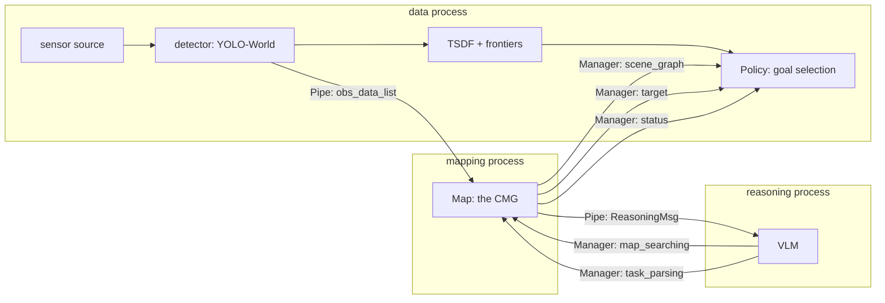
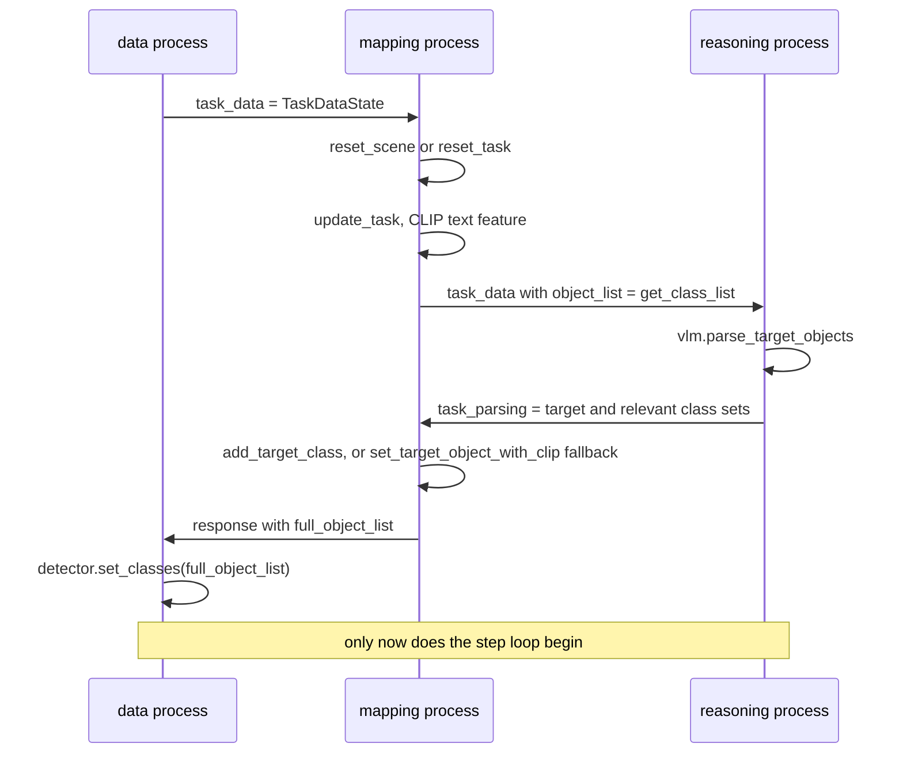
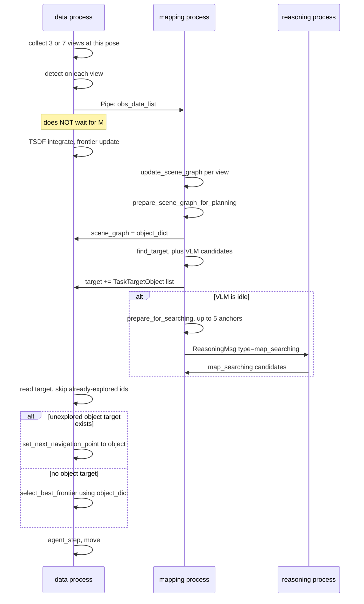

# Cognitive Memory Graph — Usage Flow

Companion to [`map_class_diagram.md`](map_class_diagram.md). That doc covers
what the graph *is* and what it consumes. This one covers how it is **driven
and read at runtime**, so the graph can be lifted into another repository
without the Habitat harness.

Line references are against commit `ffc1517`.

---

## 1. What is portable and what is not

| Layer | Files | Portable? |
|---|---|---|
| **The graph itself** | `map/map.py`, `map/map_elements.py`, `map/pointcloud.py`, `map/map_utils.py` | **Yes** — depends only on numpy, torch, open3d, open_clip, ultralytics-SAM, pulp |
| Orchestration | `map/multi_level_perception.py`, `map/communication.py` | Yes, but rewrite to your own concurrency model |
| Reasoning | `vlm/` | Yes — plain HTTP or local `transformers`, no simulator coupling |
| Episode parsing | `habitat/hm3d_v1.py`, `habitat/mp3d.py` | **Yes** — stdlib only (`gzip`, `json`, `pathlib`); no simulator dependency at all. Only useful for HM3D/MP3D benchmarking |
| Metrics | `habitat/evaluation.py` | **Mostly** — `euclidean_distance`, `check_objectnav_success`, `compute_spl` are pure numpy; only the two geodesic functions need `habitat_sim` |
| Simulator binding | `habitat/habitat_data.py` | **No** — it *is* the simulator: `habitat_sim.Simulator`, agent, sensors, navmesh `pathfinder` |
| Driver loop | `habitat/nav_runner.py` | **Read, don't port** — the clearest reference for sequencing CMG calls, but every concrete call is Habitat-bound |
| Exploration / planning | `planner/`, `habitat/policy.py` | **No** — TSDF + frontier logic, and it queries the oracle navmesh *inside the control loop* (see below) |

`Map` never imports anything from `habitat/` or `planner/`. The dependency
runs one way, so the graph can be extracted as-is.

### Three kinds of non-portability

Worth separating, because they need different responses:

1. **Replaceable service.** `policy.py` and `evaluation.py` touch
   `habitat_sim` for exactly one thing — `habitat_sim.ShortestPath` plus
   `pathfinder.find_path` for geodesic distance. Swap in A* on an occupancy
   grid and both port.
2. **Frame-convention entanglement.** The y-up to z-up conversions
   (`pos_habitat_to_normal`, `pose_habitat_to_tsdf`) are threaded through
   every boundary in `nav_runner` and `policy`. On a robot with one
   consistent frame most become identity — but strip them deliberately or
   you will double-transform.
3. **Ground-truth privilege — the real blocker.** The `pathfinder` is an
   oracle navmesh and `simulator.semantic_scene.objects` is ground-truth
   semantics. This is not confined to evaluation:
   `policy.set_next_navigation_point` uses the pathfinder to find a
   navigable observation point near a target object
   ([`policy.py:426`](../habitat/policy.py)) — inside the control loop. A
   real robot has no navmesh, so this logic needs redesigning, not porting.

What a CMG port actually needs from `habitat/` is the **contract**, not the
code: a posed RGB-D source and a detector filling the detections dict.

---

## 2. Process topology

Three OS processes, spawned in `object_nav_hm3d.py:110-125`. Note the
communication is **not** symmetric: bulk observations travel by `Pipe`,
small persistent state by `Manager` dict.

Channel inventory:

| Channel | Kind | Payload | Direction |
|---|---|---|---|
| `pipe_data_map` | Pipe | `{task_id, step, robot_pos, obs_data_list}` — RGB, depth, pose, detections | data → mapping |
| `pipe_map_reasoning` | Pipe | `ReasoningMsg` — keyframe images | mapping → reasoning |
| `task_data` | Manager | `TaskDataState` | data → mapping → reasoning |
| `task_parsing` | Manager | `TaskParsingState` | reasoning → mapping |
| `response` | Manager | `TaskParsingState` enriched with the final class list | mapping → data |
| `target` | Manager | `List[TaskTargetObject]`, append-only | mapping → data |
| `status` | Manager | `TaskProgressState` | mapping → data |
| `scene_graph` | Manager | `SceneGraphState` | mapping → data |
| `map_searching` | Manager | `MapSearchingStage` | reasoning → mapping |
| `is_vlm_idle` | Manager | bool, back-pressure flag | reasoning → mapping |

---

## 3. Per-task lifecycle

Runs once per episode, before any observation is processed.

Four things a port must reproduce:

1. **Reset policy.** `cfg.reset_scene_graph_every_task` decides between
   `reset_scene()` (drop all nodes and anchors) and `reset_task()` (keep
   geometry, rebuild only the `TargetManager` index). The HM3D config sets
   it `True`; setting it `False` is what makes the graph a persistent
   cross-task memory.
2. **The class list round-trip.** The mapping process owns the vocabulary.
   It hands `get_class_list()` to the VLM, the VLM may invent new labels,
   `add_target_class` appends them, and the *final* list goes back to the
   data process so the detector can be re-prompted. Break this loop and
   `detection_class_ids` desynchronize from `get_classes_arr()`.
3. **The CLIP fallback.** If the VLM returns no usable target set,
   `set_target_object_with_clip()` picks the top-5 class *names* by
   text-text similarity to the task string.
4. **Blocking handshake.** Both sides busy-wait: `_wait_for_task_parsing`
   ([`nav_runner.py:230`](../habitat/nav_runner.py)) polls with **no
   timeout**, and the mapping process polls for `task_parsing` the same
   way. A VLM failure here hangs the episode.

---

## 4. Per-step loop

One iteration of `_run_navigation_loop`
([`nav_runner.py:334`](../habitat/nav_runner.py)), paired with one iteration
of `mapping_thread` ([`multi_level_perception.py:39`](../map/multi_level_perception.py)).

### Ordering facts a port must preserve

- **Multi-view capture.** Each step captures `1 + extra_view_phase_*` views
  by rotating in place — 7 at step 0, 3 thereafter. All views of a step are
  sent as one `obs_data_list` and fed to `update_scene_graph` **individually**,
  each with its own `frame_idx`. Single-view stepping produces a much sparser
  graph.
- **The graph update is fire-and-forget.** The data process sends and moves
  straight on to TSDF integration. It never blocks on the mapping process,
  so the `target` and `scene_graph` it reads may be **one or more steps
  stale**. This is deliberate: the figure's "High Freq 10-20 Hz" layer must
  not stall on the "Low Freq 1-2 Hz" layer.
- **`frame_idx` is globally monotonic across episodes.** `frame_index`
  starts at 1 and is threaded through every task
  ([`nav_runner.py:544`](../habitat/nav_runner.py)), never reset. Required
  because graph state can outlive a task.
- **Goal priority.** An unexplored object target preempts frontier
  exploration, but only when `policy.max_point_type != "object"` — the robot
  does not abandon one object goal for another. Frontier selection is the
  fallback only when no object target exists and no goal is active.
- **`target` is append-only.** The mapping process only ever does
  `shared_data_map["target"] += new_list`. Deduplication is the *consumer's*
  job, via `explored_target_dict["object"]`. A port that expects the producer
  to dedupe will re-navigate to the same object forever.

---

## 5. The CMG's public surface

This is the API a replication must provide. Everything else in `Map` is
internal.

### Write path

| Method | Called by | Purpose |
|---|---|---|
| `update_scene_graph(...)` | mapping loop, once per view | the whole construct/update/refine pipeline |
| `update_task(task)` | task start | embed task string, enables `task_score` |
| `add_target_class(...)` | task start | set target/relevant class sets, append new labels |
| `set_target_object_with_clip()` | task start, fallback | pick target classes by text-text CLIP |
| `reset_scene()` / `reset_task()` | task start | drop everything / keep geometry, reindex |

### Read path

| Method | Returns | Consumer |
|---|---|---|
| `prepare_scene_graph_for_planning()` | `{obj_id: [label, task_score, size, position]}` | planner, every step |
| `find_target(exclude_ids)` | `(target_objects, relevant_objects, target_keyframes, relevant_keyframes)` | mapping loop, every step |
| `prepare_for_searching(excluded_ids, n)` | `(keyframe_ids, images, object_labels)` | VLM background search |
| `prepare_for_checking_finish(objects)` | `(images, objects_per_frame, keyframe_ids)` | VLM arrival verification |
| `keyframe_2d_to_3d(kf, bbox, recover_scale)` | `(pcd, bbox_3d, bbox_2d, mask)` | lifting a VLM bbox on a stored anchor |
| `get_class_list()` | `List[str]` | detector prompting, VLM prompting |

### Write-back path — the graph is corrected by its consumers

Easy to miss, and load-bearing:

| Call | Trigger | Effect |
|---|---|---|
| `target_manager.add_objects_to_blacklist({id})` | VLM says an arrived-at object does not satisfy the task ([`multi_level_perception.py:350`](../map/multi_level_perception.py)) | that node is permanently excluded from `find_target` |
| `target_manager.add_keyframes_to_blacklist(ids)` | reserved; defined but not called in the current pipeline | excludes anchors from search and targeting |
| `MapSearchingStage.processed_kf_ids` | reasoning process, after each search | stops the same anchor being re-sent to the VLM |

Without the object blacklist the robot loops: it navigates to a candidate,
the VLM rejects it, and `find_target` immediately re-proposes it.

---

## 6. The two consumers

### Consumer A — the planner, every step

Receives only the flattened `object_dict`. Used in
`Policy.compute_frontier_semantic_scores`
([`policy.py:84`](../habitat/policy.py)): for each frontier, take its `topk=3`
nearest objects within `3 x size`, weight a Gaussian of distance by the
object's `task_score`, and sum.

**Caveat, verified:** `Object3D.task_score` is never assigned — declared
`0.0` at [`map_elements.py:105`](../map/map_elements.py), and its only write
is `max(self.task_score, other.task_score)` in `merge`, always `max(0,0)`.
So `semantic_scores` is identically zero, `boost_relevant_objects` is a
no-op, and
`frontier_scores = semantic_scores + context_weight * context_scores`
collapses to the whole-image CLIP term alone. **In the current code the graph
does not influence exploration at all.** A replication that wants the
figure's "Score Map" behaviour must set this — the natural definition is
cosine between `Object3D.clip_ft` and `TargetManager.task_clip_ft`, assigned
at construction and re-assigned on merge.

### Consumer B — the VLM, opportunistically

Gated on `is_vlm_idle`, so at most one request is outstanding. Two request
types, both with a strict 3-line reply contract parsed in
[`vlm/vlm.py`](../vlm/vlm.py):

| Type | Input | Reply | Effect |
|---|---|---|---|
| `map_searching` | up to `prompt_max_num: 5` anchor images + their object labels | `1/2`, then `image_idx, object_name, x_min, y_min, x_max, y_max` normalized to 0-1, then evidence | a candidate is appended to `MapSearchingStage.candidates` |
| `checking_finish` | the live arrival frame + its detections | same shape | `is_finished`, else the object is blacklisted |

Anchor selection priority in `prepare_for_searching`: keyframes containing a
target class, then a relevant class, then highest `task_score`; always minus
`processed_kf_ids` and the keyframe blacklist.

**VLM-found targets are not graph nodes.** A candidate with a bbox is lifted
by `keyframe_2d_to_3d`, given a fresh id from `object_id_counter`, and sent
to the planner as a `TaskTargetObject` — it is never inserted into
`Map.objects_3d` ([`multi_level_perception.py:244`](../map/multi_level_perception.py)).
They are navigation goals, not memory. Note this **consumes ids from the same
counter** as real nodes, so ids are not dense.

---

## 7. Concurrency contract

| Property | Value |
|---|---|
| Graph updates | asynchronous, fire-and-forget; consumers tolerate stale reads |
| VLM requests | at most one outstanding, gated by `is_vlm_idle` |
| Blocking wait 1 | task parsing at episode start — **no timeout** |
| Blocking wait 2 | arrival verification — **30 s timeout**, then treated as not finished |
| Graph ownership | single writer; only the mapping process mutates `Map` |
| Start method | `spawn`, so `Map` and all models are constructed per process |

The single-writer property is what makes the port tractable: you can replace
the three processes with threads, an async loop, or a single synchronous loop
without touching `Map`, as long as nothing else mutates it.

---

## 8. Minimal replication

The smallest useful port, in dependency order.

**Required**

1. A posed RGB-D source — `T_world_camera`, depth in metres, matching
   resolution. See section 1 of the class-diagram doc for exact shapes.
2. An open-vocabulary detector filling the `detections` dict, with
   `detection_class_ids` indexing `get_classes_arr()`, sorted by descending
   confidence.
3. A synchronous driver loop: `update_task` → `add_target_class` →
   `update_scene_graph` per frame. This alone builds a complete graph.
4. Your own serialization. **None exists** — `save_to_disk` is referenced at
   `utils/build_map_rgbd.py:267` but commented out and never defined. Dump
   `objects_3d` point clouds plus a JSON of `{object_id: {label, position,
   size, observers}}` and `{frame_id: {pose, objects_3d}}`.

**Add for task-conditioned behaviour**

5. A VLM returning the 3-line contract, or hardcode `target_class_set` to
   skip parsing entirely.
6. The `map_searching` loop with `processed_kf_ids` bookkeeping.
7. The object blacklist write-back — otherwise rejected candidates repeat.

**Add for navigation**

8. `prepare_scene_graph_for_planning` into your own planner, and fix
   `Object3D.task_score` first or the signal is all zeros.

**Do not port**

- `map/hierarchy_clustering.py` and `map/grid_map.py` — instantiated-but-unused
  and never-instantiated respectively.
- `utils/build_map_rgbd.py` as-is — it imports the missing
  `map.depth_completion` and calls a nonexistent `Map.grid_map`. Useful as a
  template for the driver loop in step 3, not as working code.
