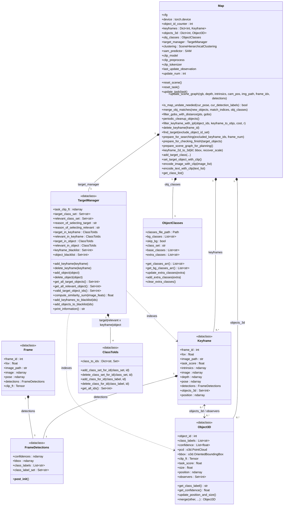
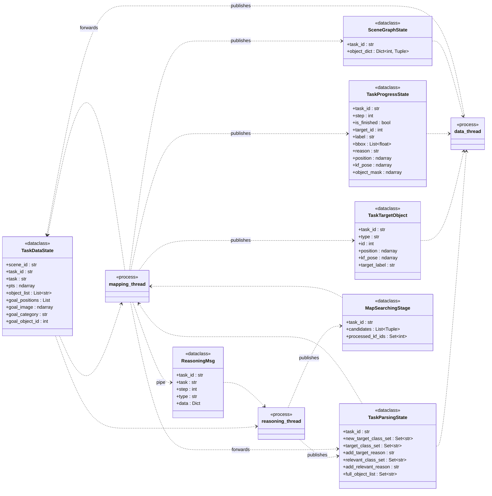
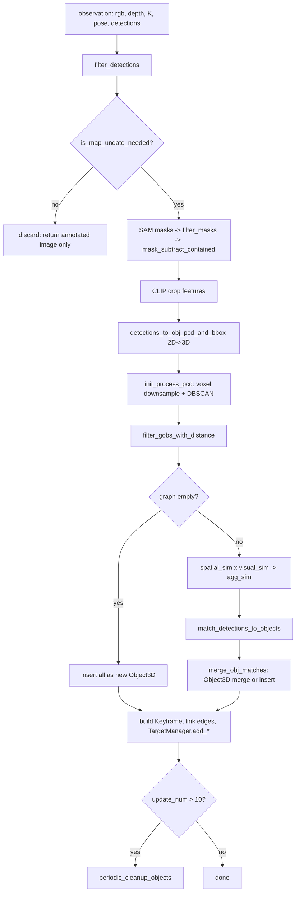
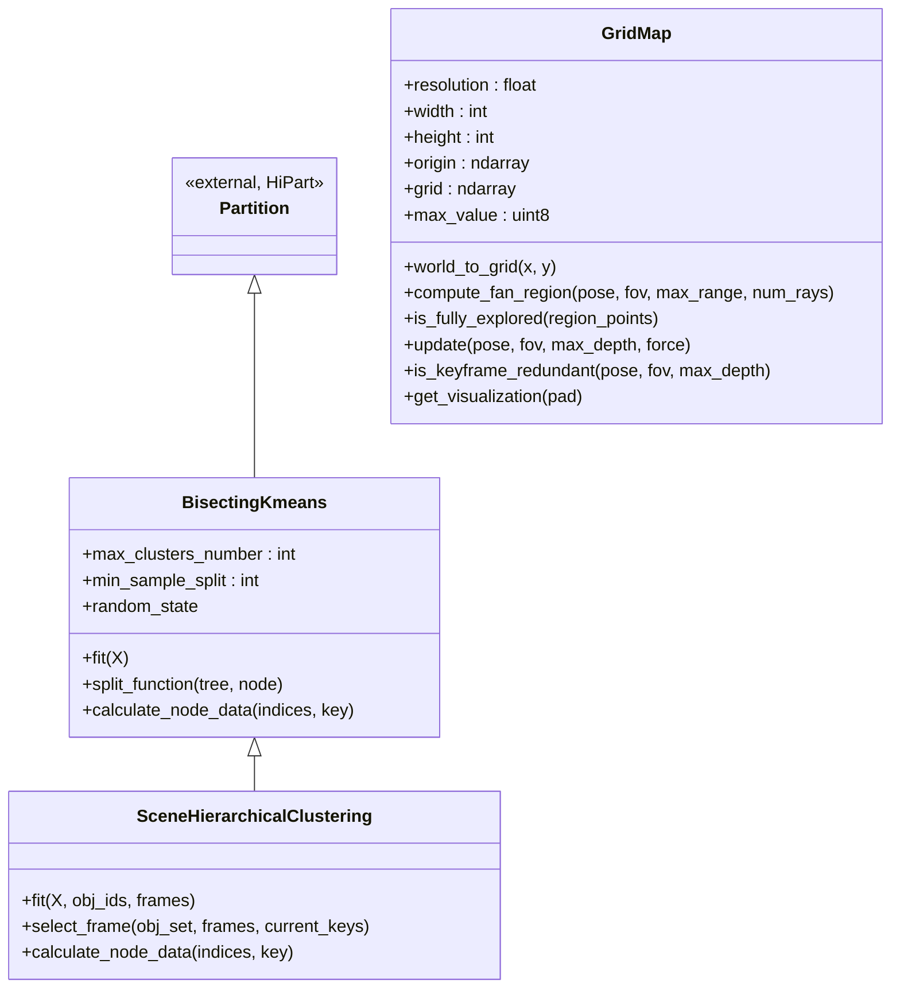

# `map/` — Class Diagram (Cognitive Memory Graph)

Reference for the Layer 2 "Memory Construction" subsystem. The paper's
**Cognitive Memory Graph** is called the *scene graph* in code; the term
"cognitive memory graph" appears only as a label in `figures/framework.svg`.

All line references are against the tree at commit `ffc1517`.

See [`cmg_usage_flow.md`](cmg_usage_flow.md) for how the graph is driven
and consumed at runtime, and for a replication checklist. See
[`cmg_construction_pipeline.md`](cmg_construction_pipeline.md) for the
pixels-to-nodes pipeline, split into stages that can be built independently.

---

## 1. Inputs the graph requires

`Map` has exactly two input channels: a per-observation call and a per-task
setup call. Everything else is config plus models it loads itself.

### 1.1 Per observation — `update_scene_graph`

[`map.py:551`](../map/map.py)

```python
scene_map.update_scene_graph(
    image_rgb,   # uint8 (H, W, 3), RGB order
    depth,       # float32 (H, W), metres, 0 = invalid
    intrinsics,  # (3,3) or (4,4) pinhole
    cam_pos,     # (4,4) T_world_camera
    img_path,    # str, label only
    frame_idx,   # int, globally unique
    detections,  # dict, see 1.2
    visualization=False,
)
```

| Arg | Type / shape | Contract |
|---|---|---|
| `image_rgb` | `uint8 (H,W,3)` | **RGB order**, not BGR. The Habitat path calls `rgba2rgb` first ([`habitat_data.py:304`](../habitat/habitat_data.py)) |
| `depth` | `float32 (H,W)` | **metres**, same `H,W` as `image_rgb`. `0` means invalid — `z > 0` is the validity test ([`pointcloud.py:178`](../map/pointcloud.py)) |
| `intrinsics` | `(3,3)` or `(4,4)` | Pinhole `fx, fy, cx, cy`. Only `[:3,:3]` is used; `[0,0]` also yields the stored FOV |
| `cam_pos` | `float (4,4)` | **`T_world_camera`** (camera→world). Camera frame is OpenCV: x right, y down, z forward. Applied as `trans_pose @ [x,y,z,1]` ([`pointcloud.py:199`](../map/pointcloud.py)) |
| `img_path` | `str` | Stored on the `Keyframe` as a label only — never opened by `Map` |
| `frame_idx` | `int` | **Globally unique and stable.** It is the `Map.keyframes` key *and* the element stored in `Object3D.observers`; reusing an id corrupts edges |
| `detections` | `dict` | See 1.2 |

On the Habitat path `cam_pos` is `pose_habitat_to_tsdf(cam_pose)`
([`nav_runner.py:165`](../habitat/nav_runner.py)), whose docstring spells out
the chain `Thb -> Twb -> Twc`. The world frame is therefore **z-up**
(Habitat's y-up rotated), not Habitat's native frame.

### 1.2 The `detections` dict

| Key | Type | Contract |
|---|---|---|
| `xyxy_np` | `float (N,4)` | Pixel coords in the `image_rgb` frame |
| `confidences` | `float (N,)` | See the sort-order constraint in 1.5 |
| `detection_class_ids` | `int (N,)` | **Must be valid indices into `Map.obj_classes.get_classes_arr()`** — the node label is `classes[class_id]` ([`map.py:788`](../map/map.py)) |
| `detection_class_labels` | `List[str]`, len `N` | Drives the keyframe gate and the filters |
| `masks_np` | `bool (N,H,W)` or `None` | If `None`, `Map` runs SAM on the boxes itself. If provided, must match `depth`'s `H,W` |

`Map` does **not** run the detector — that is the caller's job
([`nav_runner.py:91`](../habitat/nav_runner.py) `_extract_detections`). The
caller must also keep the detector's class list in sync via
`set_classes(get_classes_arr())`, or `class_id` indexing drifts — most easily
after the VLM appends new classes mid-task through `add_target_class`.

### 1.3 Per task — before anything can be marked a target

```python
scene_map.update_task(task_string)   # -> CLIP text feature, drives Keyframe.task_score
scene_map.add_target_class(...)      # target/relevant class sets from the VLM
# or, when the VLM returns nothing usable:
scene_map.set_target_object_with_clip()
```

Skip these and the graph still builds geometrically, but
`TargetManager.target_class_set` stays empty, so `find_target` returns
nothing, every `task_score` is `0.0`, and the keyframe gate loses its
"a target class appeared" trigger.

### 1.4 Loaded by `Map.__init__` itself

- **SAM** via ultralytics, `cfg.sam_model_name` (`mobile_sam.pt`) — always
  loaded, even if you always supply `masks_np`
- **open_clip ViT-B-32 / `laion2b_s34b_b79k`** — downloaded on first use
- **`data/scannet200_classes.txt`** — path hardcoded at
  [`map_elements.py:382`](../map/map_elements.py) when
  `class_set: scannet200`, overriding the `classes_file_path` argument
- CUDA is not required but is the default; `Map` passes `self.device` down

Config keys `Map` reads: `sam_model_name`, `class_set`, `bg_classes`,
`skip_bg`, `prompt_h`, `prompt_w`,
`object_detection_confidence_threshold`, `object_detection_min_area_ratio`,
`mask_area_threshold`, `mask_area_ratio`, `mask_iou_threshold`,
`min_points_threshold`, `spatial_sim_type`, `obj_pcd_max_points`,
`downsample_voxel_size`, `dbscan_remove_noise`, `dbscan_eps`,
`dbscan_min_points`, `phys_bias`, `sim_threshold`, `use_clip_mapping`,
`use_ilp_keyframe_pruning`, `scene_graph.obj_include_dist`.
(`yolo_model_name` appears only in a commented-out block at
[`map.py:87`](../map/map.py) — `Map` does not need it.)

### 1.5 Undocumented constraint: detections must arrive confidence-sorted

[`filter_detections`](../map/map_utils.py) (`map_utils.py:183`) sorts the
detections by descending confidence into `detections_combined`, collects
`keep_idx_list` as indices **into that sorted list**, then applies those
indices to the **original, unsorted** arrays:

```python
detections_combined = sorted(zip(confidences, xyxy, class_ids, class_labels),
                             key=lambda x: x[0], reverse=True)
for idx, current_det in enumerate(detections_combined):
    ...
    keep_idx_list.append(idx)
    keep_lables.append(curr_label)
...
return xyxy[keep_idx_list], confidences[keep_idx_list], class_ids[keep_idx_list], keep_lables, keep_masks
```

`keep_lables` is in sorted order; boxes, confidences, class ids and masks are
indexed in original order. These agree **only if the input already arrives
sorted by descending confidence** — true for ultralytics, whose NMS returns
confidence-descending results, so the live pipeline is unaffected.

If you feed your own detector, **sort by descending confidence before
calling**, or boxes and labels are silently mismatched. Treat this as a
latent bug rather than an intended contract.

Related: with `use_clip_mapping: False`, `image_feats` stays a zero array
([`map.py:669`](../map/map.py)), so the `visual_sim` half of the association
score is meaningless and matching degenerates to point-cloud overlap alone.

---

## 2. Core graph classes



### `Map` methods by phase

| Phase | Methods |
|---|---|
| Lifecycle | `reset_scene`, `reset_task`, `update_task` |
| Construct / update | `update_scene_graph`, `is_map_undate_needed`, `merge_obj_matches`, `filter_gobs_with_distance` |
| Refine | `periodic_cleanup_objects`, `filter_keyframe_with_ipl`, `delete_keyframe` |
| Query / decompose | `find_target`, `prepare_for_searching`, `prepare_for_checking_finish`, `prepare_scene_graph_for_planning`, `keyframe_2d_to_3d` |
| Target selection | `add_target_class`, `set_target_object_with_clip`, `encode_image_with_clip`, `encode_text_with_clip`, `get_class_list` |
| Debug printing | `print_keyframe_objects`, `print_objects_keyframe`, `print_map_object_labels`, `get_all_object_pointcloud` |

### The graph edges are implicit

There is no `Edge` class and no `networkx`. The graph is a **bipartite
id-set pairing**, maintained by hand in two places:

| Direction | Field | Written at |
|---|---|---|
| anchor → objects | `Keyframe.objects_3d : Set[int]` | [`map.py:871`](../map/map.py) (construction) |
| object → anchors | `Object3D.observers : Set[int]` | [`map.py:798`](../map/map.py) (insert) / [`map_elements.py:172`](../map/map_elements.py) (`merge`) |

Both must be kept in sync; `delete_keyframe` ([`map.py:420`](../map/map.py))
is the only place that unwinds an edge from the anchor side.

---

## 3. Inter-process message classes (`map/communication.py`)

These are *not* part of the graph — they are the serialization boundary
between the three processes launched in `object_nav_hm3d.py`. `*State`
objects go through a `multiprocessing.Manager` dict; `*Msg` objects go
through a `Pipe`.



`SceneGraphState.object_dict` is the *only* view of the graph that leaves
the mapping process: a flat `{object_id: (class_label, task_score, size,
position)}` produced by `Map.prepare_scene_graph_for_planning()`
([`map.py:219`](../map/map.py)). Point clouds, bboxes, CLIP features and
all keyframe data stay process-local.

---

## 4. `Frame` vs `Keyframe`

Same origin (one camera observation + its 2D detections), different
subsystems, different processes. They never cross the pipe.

| | `Frame` ([`map_elements.py:54`](../map/map_elements.py)) | `Keyframe` ([`map_elements.py:71`](../map/map_elements.py)) |
|---|---|---|
| `frame_id`, `fov`, `image`, `image_path`, `pose`, `detections` | yes | yes |
| `intrinsics` | — | yes |
| `depth` | — | yes |
| `objects_3d` (graph edge) | — | yes |
| `clip_ft` (full-image CLIP vector) | yes | — |
| `task_score` (scalar CLIP sim to task) | — | yes |
| Created in | `nav_runner.py:200` (data process), **every** observation | `map.py:871` (mapping process), only gated observations |
| Owned by | `Frontier.frame` ([`tsdf_planner.py:42`](../planner/tsdf_planner.py)) | `Map.keyframes` |
| Purpose | frontier snapshot for exploration scoring | **visual anchor** node in the memory graph |
| Lifetime | as long as its frontier | until ILP pruning evicts it |

Consequences of the asymmetry:

- `Keyframe` keeps `depth` + `intrinsics`, so it can be re-projected to 3D
  long after recording — this is what `keyframe_2d_to_3d` uses when the VLM
  returns a 2D bbox on an old anchor image. `Frame` discards depth and can
  never be lifted.
- `Frame` keeps a full CLIP embedding (filled lazily at
  [`policy.py:190`](../habitat/policy.py)) because frontiers are compared to
  each other by image similarity. `Keyframe` stores only the scalar
  `task_score`, used to rank anchors in `prepare_for_searching`.

---

## 5. Node admission and merge rules



**Keyframe admission gate** — `is_map_undate_needed`
([`map.py:512`](../map/map.py)) returns true when any holds:
translation > 1 m, rotation > 45 deg, this is the first frame, or a
target/relevant class appears in the current detections. Otherwise the
observation is dropped entirely, which is what keeps anchors sparse.

**Object association score** — [`map.py:838`](../map/map.py):

```
agg_sim = (1 + phys_bias) * spatial_sim + (1 - phys_bias) * visual_sim
```

with `phys_bias: 0.5` and acceptance threshold `sim_threshold: 0.6`
(`cfg/hm3d.yaml`). `spatial_sim` is point-cloud overlap from
`compute_overlap_matrix_general`; `visual_sim` is cosine on CLIP crop
features.

**Object3D.merge** ([`map_elements.py:139`](../map/map_elements.py)) fuses
point clouds (voxel-downsampled and refit to a new bbox; DBSCAN is skipped
because `merge_obj_matches` passes `run_dbscan=False`, and it runs later in
`periodic_cleanup_objects`), takes a
**detection-count-weighted mean** of `clip_ft`, `max` of `task_score`,
**appends** to `class_labels` / `confidence` (so the label is a running
majority vote via `get_class_label()`), and unions `observers`.

**Refinement** — `periodic_cleanup_objects` ([`map.py:964`](../map/map.py))
runs every 10 updates: DBSCAN denoise on every object, then anchor pruning.
With `use_ilp_keyframe_pruning: True` this is a PuLP set-cover ILP
(`filter_keyframe_with_ipl`, [`map.py:915`](../map/map.py)) keeping the
minimum anchor set that observes every object at least `r=1` times;
otherwise a greedy subset-check fallback.

---

## 6. Module map

| File | Lines | Role |
|---|---|---|
| [`map/map_elements.py`](../map/map_elements.py) | 423 | **the graph data model** — start here |
| [`map/map.py`](../map/map.py) | 1011 | `Map`: construction, update, refinement, query |
| [`map/pointcloud.py`](../map/pointcloud.py) | 826 | 2D→3D lifting, bbox fitting, overlap matrices, DBSCAN denoise |
| [`map/map_utils.py`](../map/map_utils.py) | 490 | detection/mask filtering, CLIP encoding, association |
| [`map/multi_level_perception.py`](../map/multi_level_perception.py) | 512 | `mapping_thread` / `reasoning_thread` — the drivers |
| [`map/communication.py`](../map/communication.py) | 145 | IPC dataclasses (section 2) |
| [`map/hierarchy_clustering.py`](../map/hierarchy_clustering.py) | 463 | **unused** (see below) |
| [`map/grid_map.py`](../map/grid_map.py) | 154 | **unused** (see below) |

### Classes present but not in the live pipeline



- `SceneHierarchicalClustering` is **instantiated** at
  [`map.py:75`](../map/map.py) as `self.clustering` and then never
  referenced again. Vendored from the HiPart package.
- `GridMap` is **never instantiated** anywhere in the repo.
  `utils/build_map_rgbd.py:241` calls `scene_map.grid_map`, an attribute
  `Map` does not define.

### Field-level oddities

- `Object3D.position` is declared twice
  ([`map_elements.py:99`](../map/map_elements.py) as
  `Optional[o3d.geometry.PointCloud]`, then
  [`:107`](../map/map_elements.py) as `Optional[np.ndarray]`). The second
  annotation wins; it holds a 3-vector bbox center set by
  `update_position_and_size()`.
- `Keyframe.position` (commented "average center of object 3d bbox") is
  never assigned or read.
- `Frame` is imported into [`map.py:25`](../map/map.py) but unused there.
- [`multi_level_perception.py:326`](../map/multi_level_perception.py)
  constructs a `Keyframe` that is deliberately **not** inserted into
  `Map.keyframes` — it is a throwaway wrapper so the arrival-check
  observation can reuse `keyframe_2d_to_3d`. Not a second construction site.
- There is no serialization. `Map.save_to_disk` is called at
  `utils/build_map_rgbd.py:267` but commented out and never defined.
