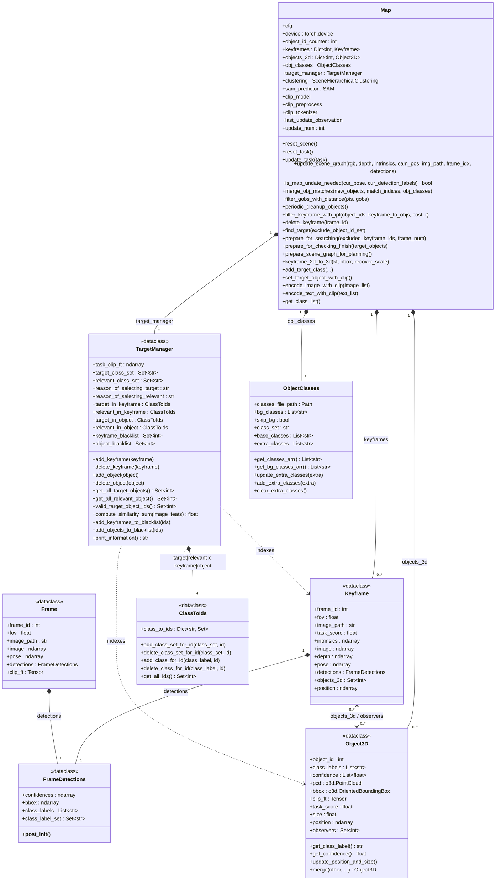
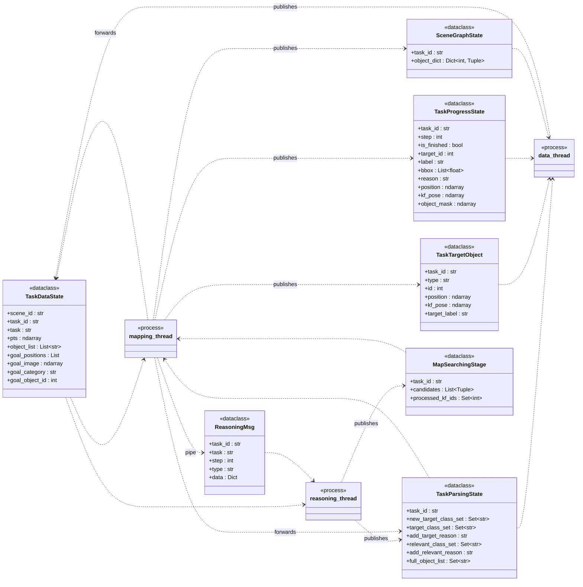
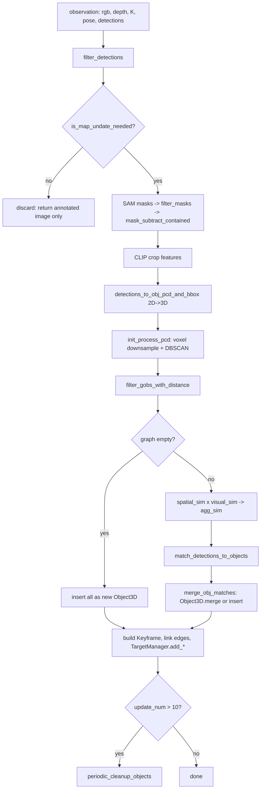
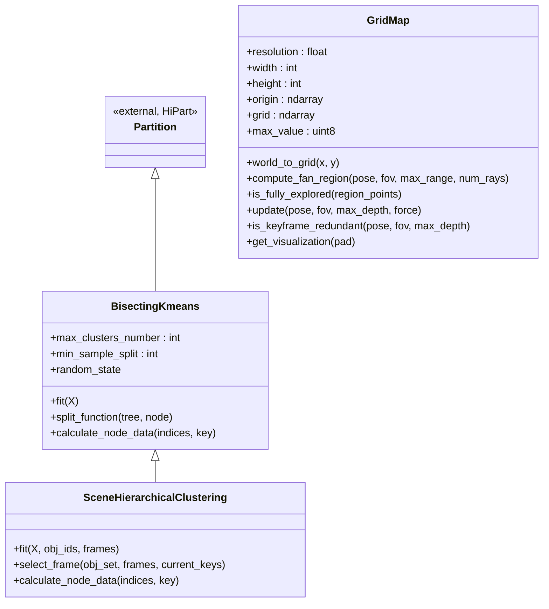

# `map/` — Class Diagram (Cognitive Memory Graph)

Reference for the Layer 2 "Memory Construction" subsystem. The paper's
**Cognitive Memory Graph** is called the *scene graph* in code; the term
"cognitive memory graph" appears only as a label in `figures/framework.svg`.

All line references are against the tree at commit `ffc1517`.

---

## 1. Core graph classes



### `Map` methods by phase

| Phase | Methods |
|---|---|
| Lifecycle | `reset_scene`, `reset_task`, `update_task` |
| Construct / update | `update_scene_graph`, `is_map_undate_needed`, `merge_obj_matches`, `filter_gobs_with_distance` |
| Refine | `periodic_cleanup_objects`, `filter_keyframe_with_ipl`, `delete_keyframe` |
| Query / decompose | `find_target`, `prepare_for_searching`, `prepare_for_checking_finish`, `prepare_scene_graph_for_planning`, `keyframe_2d_to_3d` |
| Target selection | `add_target_class`, `set_target_object_with_clip`, `encode_image_with_clip`, `encode_text_with_clip`, `get_class_list` |
| Debug printing | `print_keyframe_objects`, `print_objects_keyframe`, `print_map_object_labels`, `get_all_object_pointcloud` |

### The graph edges are implicit

There is no `Edge` class and no `networkx`. The graph is a **bipartite
id-set pairing**, maintained by hand in two places:

| Direction | Field | Written at |
|---|---|---|
| anchor → objects | `Keyframe.objects_3d : Set[int]` | [`map.py:871`](../map/map.py) (construction) |
| object → anchors | `Object3D.observers : Set[int]` | [`map.py:798`](../map/map.py) (insert) / [`map_elements.py:172`](../map/map_elements.py) (`merge`) |

Both must be kept in sync; `delete_keyframe` ([`map.py:420`](../map/map.py))
is the only place that unwinds an edge from the anchor side.

---

## 2. Inter-process message classes (`map/communication.py`)

These are *not* part of the graph — they are the serialization boundary
between the three processes launched in `object_nav_hm3d.py`. `*State`
objects go through a `multiprocessing.Manager` dict; `*Msg` objects go
through a `Pipe`.



`SceneGraphState.object_dict` is the *only* view of the graph that leaves
the mapping process: a flat `{object_id: (class_label, task_score, size,
position)}` produced by `Map.prepare_scene_graph_for_planning()`
([`map.py:219`](../map/map.py)). Point clouds, bboxes, CLIP features and
all keyframe data stay process-local.

---

## 3. `Frame` vs `Keyframe`

Same origin (one camera observation + its 2D detections), different
subsystems, different processes. They never cross the pipe.

| | `Frame` ([`map_elements.py:54`](../map/map_elements.py)) | `Keyframe` ([`map_elements.py:71`](../map/map_elements.py)) |
|---|---|---|
| `frame_id`, `fov`, `image`, `image_path`, `pose`, `detections` | yes | yes |
| `intrinsics` | — | yes |
| `depth` | — | yes |
| `objects_3d` (graph edge) | — | yes |
| `clip_ft` (full-image CLIP vector) | yes | — |
| `task_score` (scalar CLIP sim to task) | — | yes |
| Created in | `nav_runner.py:200` (data process), **every** observation | `map.py:871` (mapping process), only gated observations |
| Owned by | `Frontier.frame` ([`tsdf_planner.py:42`](../planner/tsdf_planner.py)) | `Map.keyframes` |
| Purpose | frontier snapshot for exploration scoring | **visual anchor** node in the memory graph |
| Lifetime | as long as its frontier | until ILP pruning evicts it |

Consequences of the asymmetry:

- `Keyframe` keeps `depth` + `intrinsics`, so it can be re-projected to 3D
  long after recording — this is what `keyframe_2d_to_3d` uses when the VLM
  returns a 2D bbox on an old anchor image. `Frame` discards depth and can
  never be lifted.
- `Frame` keeps a full CLIP embedding (filled lazily at
  [`policy.py:190`](../habitat/policy.py)) because frontiers are compared to
  each other by image similarity. `Keyframe` stores only the scalar
  `task_score`, used to rank anchors in `prepare_for_searching`.

---

## 4. Node admission and merge rules



**Keyframe admission gate** — `is_map_undate_needed`
([`map.py:512`](../map/map.py)) returns true when any holds:
translation > 1 m, rotation > 45 deg, this is the first frame, or a
target/relevant class appears in the current detections. Otherwise the
observation is dropped entirely, which is what keeps anchors sparse.

**Object association score** — [`map.py:838`](../map/map.py):

```
agg_sim = (1 + phys_bias) * spatial_sim + (1 - phys_bias) * visual_sim
```

with `phys_bias: 0.5` and acceptance threshold `sim_threshold: 0.6`
(`cfg/hm3d.yaml`). `spatial_sim` is point-cloud overlap from
`compute_overlap_matrix_general`; `visual_sim` is cosine on CLIP crop
features.

**Object3D.merge** ([`map_elements.py:139`](../map/map_elements.py)) fuses
point clouds (then re-runs DBSCAN and refits the bbox), takes a
**detection-count-weighted mean** of `clip_ft`, `max` of `task_score`,
**appends** to `class_labels` / `confidence` (so the label is a running
majority vote via `get_class_label()`), and unions `observers`.

**Refinement** — `periodic_cleanup_objects` ([`map.py:964`](../map/map.py))
runs every 10 updates: DBSCAN denoise on every object, then anchor pruning.
With `use_ilp_keyframe_pruning: True` this is a PuLP set-cover ILP
(`filter_keyframe_with_ipl`, [`map.py:915`](../map/map.py)) keeping the
minimum anchor set that observes every object at least `r=1` times;
otherwise a greedy subset-check fallback.

---

## 5. Module map

| File | Lines | Role |
|---|---|---|
| [`map/map_elements.py`](../map/map_elements.py) | 423 | **the graph data model** — start here |
| [`map/map.py`](../map/map.py) | 1011 | `Map`: construction, update, refinement, query |
| [`map/pointcloud.py`](../map/pointcloud.py) | 826 | 2D→3D lifting, bbox fitting, overlap matrices, DBSCAN denoise |
| [`map/map_utils.py`](../map/map_utils.py) | 490 | detection/mask filtering, CLIP encoding, association |
| [`map/multi_level_perception.py`](../map/multi_level_perception.py) | 512 | `mapping_thread` / `reasoning_thread` — the drivers |
| [`map/communication.py`](../map/communication.py) | 145 | IPC dataclasses (section 2) |
| [`map/hierarchy_clustering.py`](../map/hierarchy_clustering.py) | 463 | **unused** (see below) |
| [`map/grid_map.py`](../map/grid_map.py) | 154 | **unused** (see below) |

### Classes present but not in the live pipeline



- `SceneHierarchicalClustering` is **instantiated** at
  [`map.py:75`](../map/map.py) as `self.clustering` and then never
  referenced again. Vendored from the HiPart package.
- `GridMap` is **never instantiated** anywhere in the repo.
  `utils/build_map_rgbd.py:241` calls `scene_map.grid_map`, an attribute
  `Map` does not define.

### Field-level oddities

- `Object3D.position` is declared twice
  ([`map_elements.py:99`](../map/map_elements.py) as
  `Optional[o3d.geometry.PointCloud]`, then
  [`:107`](../map/map_elements.py) as `Optional[np.ndarray]`). The second
  annotation wins; it holds a 3-vector bbox center set by
  `update_position_and_size()`.
- `Keyframe.position` (commented "average center of object 3d bbox") is
  never assigned or read.
- `Frame` is imported into [`map.py:25`](../map/map.py) but unused there.
- [`multi_level_perception.py:326`](../map/multi_level_perception.py)
  constructs a `Keyframe` that is deliberately **not** inserted into
  `Map.keyframes` — it is a throwaway wrapper so the arrival-check
  observation can reuse `keyframe_2d_to_3d`. Not a second construction site.
- There is no serialization. `Map.save_to_disk` is called at
  `utils/build_map_rgbd.py:267` but commented out and never defined.
